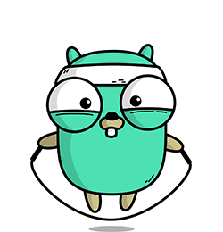

<h1 align="center">
  Binary Salute!
  
  
</h1>

<table>
  <tr>
    <td>
      <h3>About me:</h3>
      <ul>
        <li>📍 Based in Kazakhstan, Almaty</li>
        <li>👨‍🎓 First-year Bachelor’s student in Software Engineering at IITU</li>
        <li>💻 Built countless projects, so I never hesitate to dive into something new</li>
        <li>🐧 Exploring GNU/Linux system administration</li>
        <li>🧪 Experimenting with DevOps to enhance my backend workflow</li>
        <li>💼 Looking for full-time opportunities</li>
      </ul>
    </td>
    <td>
      
    </td>
  </tr>
</table>

  
<h2>👨‍💻 My Weekly Code Activity:</h2>

  

  
<h2>📊 GitHub Stats:</h2>

  
  

  
<h2> 👨‍🎓 LeetCode Stats:</h2>

  

